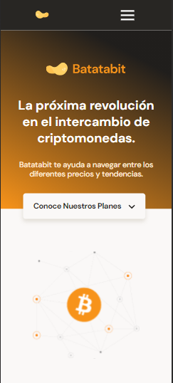
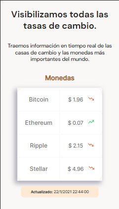
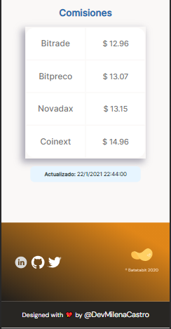
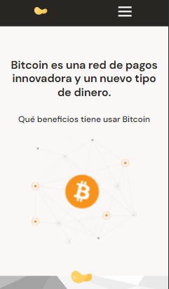
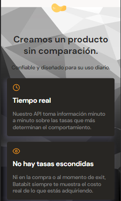
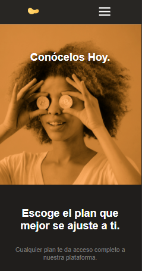
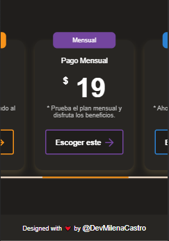

# Bitcoin-platzi 

### ¡Bienvenido 👋!

Este es un proyecto de aprendizaje elaborado en el curso de: **Curso de Responsive Design: Maquetación Mobile First**. Si tienes dudas de que es mobile First te daré una breve explicación: Es un modo de maquetar que tiene en cuenta en primer lugar los dispositivos móviles. Es decir las pantallas reducidas, desde ese punto aumenta el tamaño y se adapta a tablets y pantallas de escritorio.

Las habilidades que adquirí durante el desarrollo del proyecto fueron:

- Maquetar un sitio web desde cero en vista móvil.
- Realizar un Navbar responsivo con css y algo de JavaScript.
- Implementar HTML semántico.
- Aplicar de CSS media queries.
- Implementar SASS (.scss).
- Trabajar con la metodología BEM.

###Vista de la sección de Inicio

                              

###Vista de la sección de Beneficios

               

###Vista de la sección de Planes

               

[Ver la aplicación](https://devmilenacastro.github.io/Bitcoin-platzi/)
